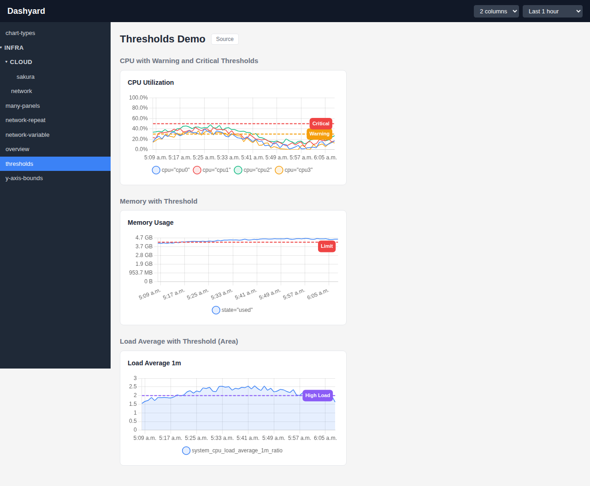
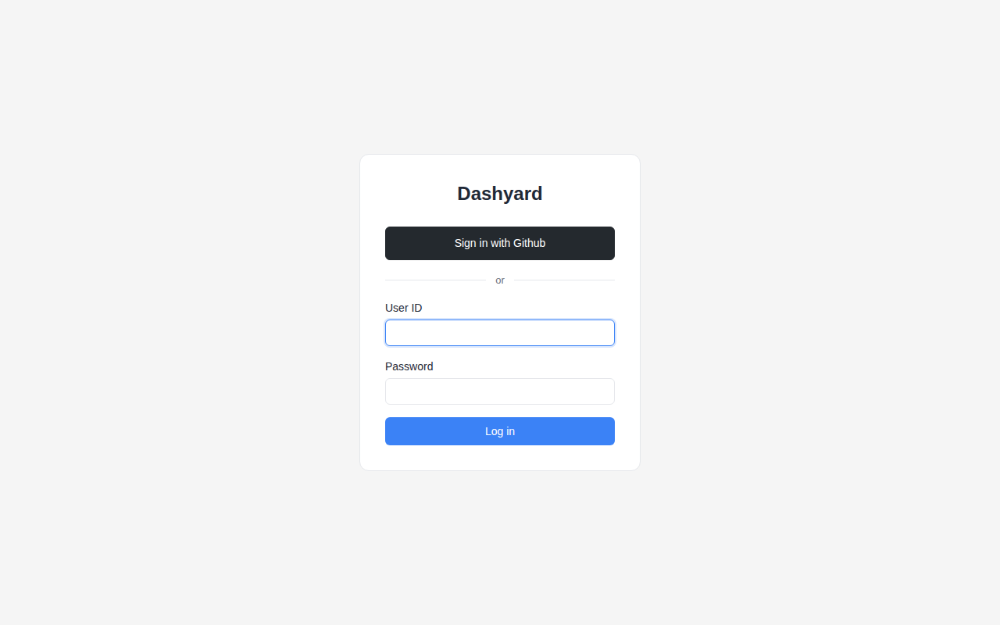

<p align="center">
  
</p>

# Dashyard

> **Warning:** This project is under active development. APIs, configuration formats, and features may change without notice.

An AI-native Prometheus dashboard. Point an LLM at your metrics, get production-ready dashboards in minutes — stored as YAML in git, served from a stateless binary.

**Why Dashyard?**
- **AI-first workflow** — `gen-prompt` scans your Prometheus and builds an LLM prompt. Claude or ChatGPT generates complete dashboards from it.
- **Dashboards as Code** — plain YAML files in a git repo. Diff, review, and version-control every change.
- **Immutable by design** — no database, no storage, no write API. The server reads YAML from disk and serves graphs. Nothing else.
- **Single binary** — one ~30MB Go binary with the frontend embedded. Docker image included.


## Features

### AI-Powered Dashboard Generation

The `gen-prompt` command reads metrics from your Prometheus server and produces a prompt file optimized for LLMs. Feed it to Claude, ChatGPT, or any other LLM to generate complete dashboard YAML files instantly.

```bash
./dashyard gen-prompt http://localhost:9090 -o .
./dashyard gen-prompt https://prom.example.com --bearer-token "eyJ..."
./dashyard gen-prompt http://localhost:9090 --match "node_.*" -o .
```

This writes `prompt.md` and `prompt-metrics.md` to the specified directory. `prompt.md` is a static template (guidelines + format reference) written only on first run — edit it freely to customize the LLM instructions. `prompt-metrics.md` is regenerated every time with the latest metrics. To reset `prompt.md` to the default, use `--force-prompt`.

Then ask an LLM to generate dashboards. For example, with Claude Code:

```
Read prompt.md and prompt-metrics.md, then generate Dashyard dashboard
YAML files for all available metrics. Write the files to ./dashboards/.
```

To update existing dashboards:

```
Read prompt.md and prompt-metrics.md, then update the dashboards in
./dashboards/. Add panels for any new metrics that are not yet covered.
```

See [docs/gen-prompt/](docs/gen-prompt/) for a complete example using a real monitoring stack.

### Dashboards as Code

Define dashboards in YAML and manage them with Git. Rows, panels, queries, and layout are all declarative. Every change is human-readable, diff-friendly, and reviewable in pull requests.

### Immutable & Secure

There is no database, no persistent storage, and no write API. The server reads dashboard YAML files from disk and proxies queries to Prometheus. Nothing to exploit, nothing to corrupt.

### Graph and Markdown Panels

Display Prometheus metrics as line, area, bar, or scatter charts. Mix in Markdown panels for documentation alongside your graphs.


### Template Variables

Add dropdown variables that dynamically filter queries. Users can switch between values (e.g. network device) without editing the dashboard definition.


### Repeat Rows

Automatically repeat a row for each value of a template variable. One row definition generates panels for every network interface, disk, or host.


### Threshold Lines

Draw horizontal reference lines on graph panels to mark warning levels, SLA targets, or capacity limits.



### Sidebar Navigation with Groups

Organize dashboards into subdirectories that become collapsible groups in the sidebar.

### Simple Auth

Session-based login with SHA-512 crypt password hashing.


### GitHub OAuth

Sign in with GitHub or GitHub Enterprise. Configure one or more OAuth providers alongside password auth. Optionally restrict access by GitHub username or organization membership.



When both password auth and OAuth are configured, users see both options on the login page.

GitHub Enterprise is supported via the `base_url` option, which overrides the OAuth and API endpoints to point to your GHE instance.

### Readiness Probe

`GET /ready` returns the server and Prometheus connectivity status. No authentication required.

```bash
curl http://localhost:8080/ready
# 200 {"status":"ok","prometheus":"reachable"}
# 503 {"status":"degraded","prometheus":"unreachable"}
```

Use it as a Docker `HEALTHCHECK`, Kubernetes readiness probe, or load balancer health check.

### Single Binary and Docker-Ready

Go backend with embedded React frontend, no external dependencies. Multi-stage Dockerfile produces a ~30MB image.

## Installation

### Download a pre-built binary

Download the latest release from the [Releases page](https://github.com/tokuhirom/dashyard/releases). Binaries are available for Linux and macOS (amd64/arm64).

```bash
# Example for Linux amd64 (replace VERSION with the desired release)
VERSION=0.0.6
curl -Lo dashyard.tar.gz "https://github.com/tokuhirom/dashyard/releases/download/v${VERSION}/dashyard_${VERSION}_linux_amd64.tar.gz"
tar xzf dashyard.tar.gz
./dashyard serve --config config.yaml
```

### Docker

```bash
docker run -p 8080:8080 \
  -v ./config.yaml:/etc/dashyard/config.yaml:ro \
  -v ./dashboards:/dashboards:ro \
  ghcr.io/tokuhirom/dashyard
```

Or build the image locally:

```bash
docker build -t dashyard .
docker run -p 8080:8080 \
  -v ./config.yaml:/etc/dashyard/config.yaml:ro \
  -v ./dashboards:/dashboards:ro \
  dashyard
```

Or use the example Docker Compose setup:

```bash
docker compose -f examples/docker-compose.yaml up
```

### Build from source

Requires Go 1.25+ and Node.js 20+.

```bash
git clone https://github.com/tokuhirom/dashyard.git
cd dashyard
make build
./dashyard serve --config examples/config.yaml
```

## Quick Start

1. Install Dashyard using one of the methods above.
2. Create a `config.yaml` (see [Configuration](#configuration) below or use `examples/config.yaml`).
3. Create dashboard YAML files in a directory (see [Dashboard Definition](#dashboard-definition) below or use `examples/dashboards/`).
4. Start the server:

```bash
./dashyard serve --config config.yaml
```

5. Open http://localhost:8080 and log in with the credentials defined in your config.

### Development

Run the three components in separate terminals:

```bash
make dev-dummyprom   # Fake Prometheus on :9090
make dev-backend     # Go server on :8080
make dev-frontend    # Vite dev server on :5173
```

To test GitHub OAuth locally, also start the fake GitHub server:

```bash
make dev-dummygithub # Fake GitHub OAuth on :5555
```

Then use `examples/config-dummygithub.yaml` as the config (it has GitHub OAuth pointing to the dummy server).

## Configuration

Create a `config.yaml` file (see `examples/config.yaml`):

```yaml
site_title: "My Monitoring"    # Optional, defaults to "Dashyard"
header_color: "#dc2626"        # Optional, any CSS color value

server:
  session_secret: "change-me-in-production"

prometheus:
  url: "http://localhost:9090"
  timeout: 30s

dashboards:
  dir: "dashboards"

users:
  - id: "admin"
    password_hash: "$6$..."

# GitHub OAuth (optional, can coexist with password auth)
auth:
  oauth:
    - provider: github
      client_id: "your-github-client-id"
      client_secret: "your-github-client-secret"
      redirect_url: "http://localhost:8080/auth/github/callback"
      # base_url: "https://ghe.example.com"  # for GitHub Enterprise
      # allowed_users: ["user1", "user2"]
      # allowed_orgs: ["my-org"]
```

Host and port are set via CLI flags (defaults: `0.0.0.0:8080`):

```bash
./dashyard serve --config config.yaml --host 127.0.0.1 --port 9090
```

Generate a password hash:

```bash
./dashyard mkpasswd <password>
```

JSON schema: [`schemas/config.schema.json`](schemas/config.schema.json)

## Dashboard Definition

Place YAML files in the dashboards directory. Subdirectories become groups in the sidebar navigation.

```
dashboards/
  overview.yaml
  infra/
    network.yaml
```

Example dashboard:

```yaml
title: "System Overview"
rows:
  - title: "CPU"
    panels:
      - title: "CPU Utilization"
        type: "graph"
        query: 'system_cpu_utilization_ratio'
        unit: "percent"
      - title: "Notes"
        type: "markdown"
        content: |
          ## About
          This panel renders **Markdown**.
```

### Panel Types

| Type | Required Fields | Optional Fields |
|------|----------------|-----------------|
| `graph` | `title`, `type`, `query` | `chart_type`, `unit`, `legend`, `y_min`, `y_max`, `y_scale`, `thresholds`, `stacked` |
| `markdown` | `title`, `type`, `content` | `full_width` |

### `chart_type`

Controls the chart visualization style. Defaults to `line` when omitted.

| Value | Description |
|-------|-------------|
| `line` | Line chart (default) |
| `area` | Line chart with filled area |
| `bar` | Bar chart |
| `scatter` | Scatter plot |

### `unit`

Controls y-axis value formatting.

| Value | Description |
|-------|-------------|
| `bytes` | Human-readable byte sizes (e.g. `1.5 GB`) |
| `percent` | Percentage with one decimal (e.g. `75.0%`). Y-axis is fixed to 0–100 unless overridden by `y_min`/`y_max`. |
| `seconds` | Human-readable time durations (e.g. `200ms`, `1.50s`, `2.5m`) |
| `count` | Numeric with SI suffixes (e.g. `1.2k`). This is also the default when `unit` is omitted. |

### `y_min` / `y_max`

Set explicit Y-axis bounds. These override the automatic scaling and any unit-based defaults (e.g. the 0–100 range for `unit: percent`). Both fields are optional and can be used independently.

```yaml
- title: "Temperature"
  type: "graph"
  query: 'sensor_temperature_celsius'
  y_min: -20
  y_max: 50
```

### `y_scale`

Set the Y-axis scale type. Defaults to `linear`. Use `log` for metrics that span multiple orders of magnitude.

| Value | Description |
|-------|-------------|
| `linear` | Linear scale (default) |
| `log` | Logarithmic scale (base 10) |

### `legend`

The `legend` field accepts a Go template string for formatting series labels (e.g. `"{{device}} {{direction}}"`).

### `thresholds`

Add horizontal reference lines to graph panels. Each threshold is drawn as a dashed line at the specified y-axis value.

| Field | Type | Required | Description |
|-------|------|----------|-------------|
| `value` | number | yes | Y-axis value where the line is drawn |
| `color` | string | no | CSS color for the line (default: `#ef4444` red) |
| `label` | string | no | Text label displayed at the end of the line |

```yaml
- title: "CPU Utilization"
  type: "graph"
  query: 'system_cpu_utilization_ratio'
  unit: "percent"
  thresholds:
    - value: 80
      color: "#f59e0b"
      label: "Warning"
    - value: 95
      color: "#ef4444"
      label: "Critical"
```

JSON schema: [`schemas/dashboard.schema.json`](schemas/dashboard.schema.json)

## Project Structure

```
cmd/
  dummyprom/          Fake Prometheus server for demos
  dummygithub/        Fake GitHub OAuth server for dev/testing
internal/
  auth/               Session management & middleware
  config/             YAML config parsing
  dashboard/          Dashboard YAML loader & store
  handler/            HTTP request handlers
  model/              Data models
  prometheus/         Prometheus API client
  server/             Gin router setup
frontend/             React/TypeScript/Vite SPA
schemas/              JSON schemas for YAML validation
examples/             Example configs and dashboards
```

## Testing

```bash
make test                        # All Go tests
go test ./internal/config/...    # Specific package
cd frontend && npm run build     # TypeScript type checking + build
```

### E2E Tests

Playwright-based end-to-end tests verify login, dashboard rendering, column selector, and Chart.js canvas resize behavior.

```bash
# Start all three services first:
make dev-dummyprom   # Terminal 1
make dev-backend     # Terminal 2
make dev-frontend    # Terminal 3

# Run E2E tests:
make test-e2e                          # Headless
cd frontend && npm run test:e2e:headed # With browser visible
cd frontend && npm run test:e2e:ui     # Interactive UI mode
```

### Updating Screenshots

With all three dev services running:

```bash
cd frontend && npx tsx take-screenshots.ts
```
