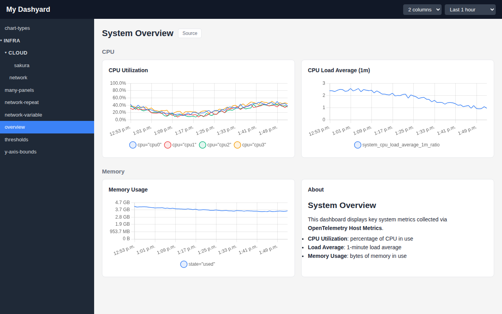
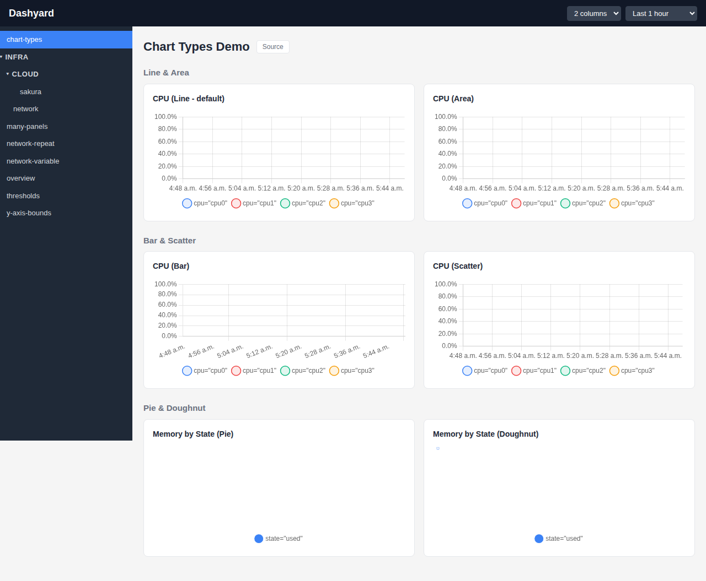
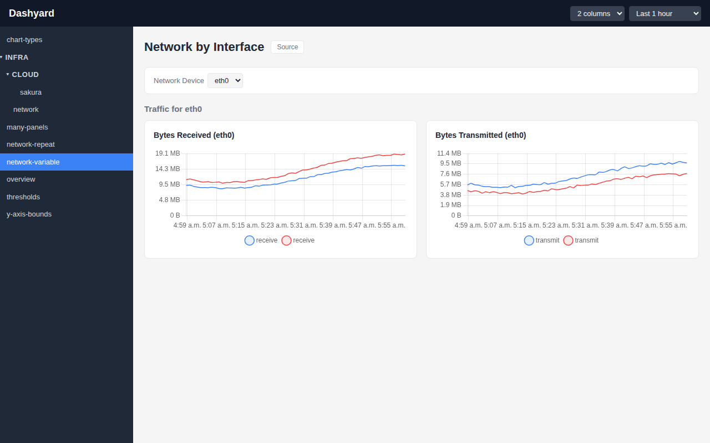
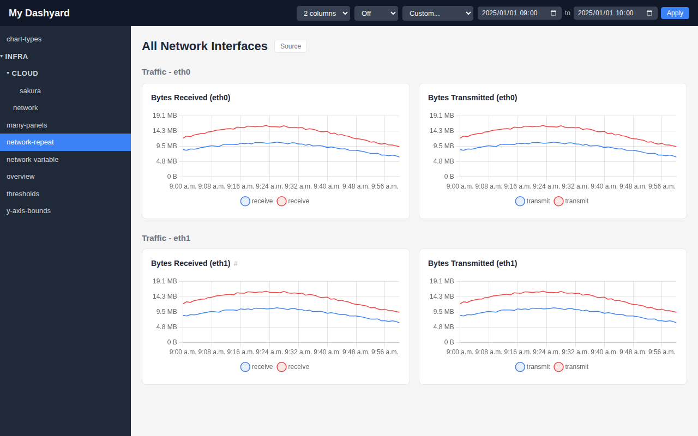
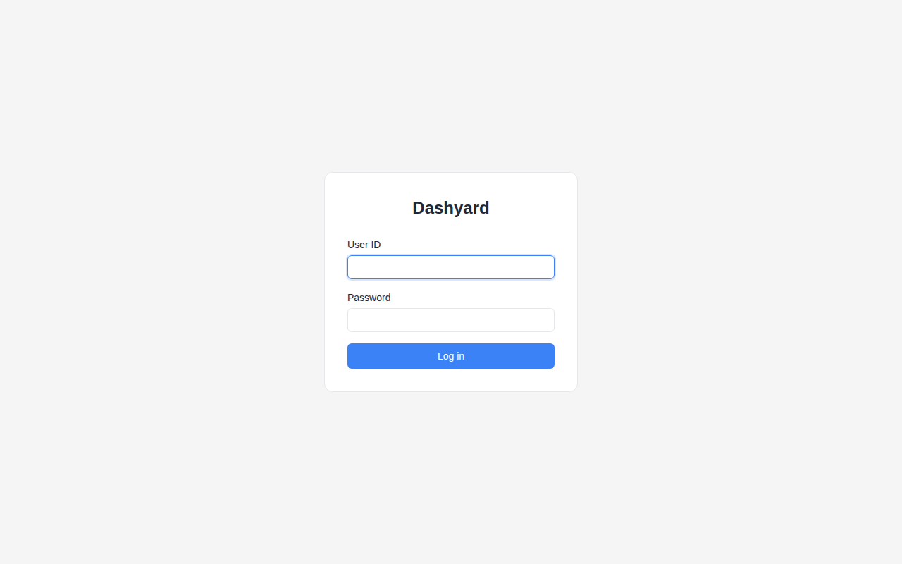

# Dashyard

> **Warning:** This project is under active development. APIs, configuration formats, and features may change without notice.

A lightweight Prometheus metrics dashboard. Define dashboards in YAML, drop them in a directory, and view metrics through a simple web UI.



## Features

### Dashboard as Code

Define dashboards in YAML and manage them with Git. Rows, panels, queries, and layout are all declarative.

### Graph and Markdown Panels

Display Prometheus metrics as line, area, bar, scatter, pie, or doughnut charts. Mix in Markdown panels for documentation alongside your graphs.



### Template Variables

Add dropdown variables that dynamically filter queries. Users can switch between values (e.g. network device) without editing the dashboard definition.



### Repeat Rows

Automatically repeat a row for each value of a template variable. One row definition generates panels for every network interface, disk, or host.



### Sidebar Navigation with Groups

Organize dashboards into subdirectories that become collapsible groups in the sidebar.

### Simple Auth

Session-based login with SHA-512 crypt password hashing.



### Single Binary and Docker-Ready

Go backend with embedded React frontend, no external dependencies. Multi-stage Dockerfile produces a ~30MB image.

## Quick Start

### Prerequisites

- Go 1.23+
- Node.js 20+
- A Prometheus server (or use the built-in dummy server for testing)

### Build and Run

```bash
# Build frontend and backend
make build

# Run with example config
./dashyard serve --config examples/config.yaml
```

Open http://localhost:8080 and log in with `admin` / `admin`.

### Development

Run the three components in separate terminals:

```bash
make dev-dummyprom   # Fake Prometheus on :9090
make dev-backend     # Go server on :8080
make dev-frontend    # Vite dev server on :5173
```

### Docker

```bash
docker build -t dashyard .
docker run -p 8080:8080 \
  -v ./config.yaml:/etc/dashyard/config.yaml:ro \
  -v ./dashboards:/dashboards:ro \
  dashyard
```

Or use the example Docker Compose setup:

```bash
docker compose -f examples/docker-compose.yaml up
```

## Configuration

Create a `config.yaml` file (see `examples/config.yaml`):

```yaml
site_title: "My Monitoring"    # Optional, defaults to "Dashyard"
header_color: "#dc2626"        # Optional, any CSS color value

server:
  session_secret: "change-me-in-production"

prometheus:
  url: "http://localhost:9090"
  timeout: 30s

dashboards:
  dir: "dashboards"

users:
  - id: "admin"
    password_hash: "$6$..."
```

Host and port are set via CLI flags (defaults: `0.0.0.0:8080`):

```bash
./dashyard serve --config config.yaml --host 127.0.0.1 --port 9090
```

Generate a password hash:

```bash
./dashyard mkpasswd <password>
```

JSON schema: [`schemas/config.schema.json`](schemas/config.schema.json)

## Dashboard Definition

Place YAML files in the dashboards directory. Subdirectories become groups in the sidebar navigation.

```
dashboards/
  overview.yaml
  infra/
    network.yaml
```

Example dashboard:

```yaml
title: "System Overview"
rows:
  - title: "CPU"
    panels:
      - title: "CPU Utilization"
        type: "graph"
        query: 'system_cpu_utilization_ratio'
        unit: "percent"
      - title: "Notes"
        type: "markdown"
        content: |
          ## About
          This panel renders **Markdown**.
```

### Panel Types

| Type | Required Fields | Optional Fields |
|------|----------------|-----------------|
| `graph` | `title`, `type`, `query` | `unit` (`bytes`, `percent`, `count`), `legend` |
| `markdown` | `title`, `type`, `content` | -- |

The `legend` field accepts a Go template string for formatting series labels (e.g. `"{{device}} {{direction}}"`).

JSON schema: [`schemas/dashboard.schema.json`](schemas/dashboard.schema.json)

## Project Structure

```
cmd/
  dummyprom/          Fake Prometheus server for demos
internal/
  auth/               Session management & middleware
  config/             YAML config parsing
  dashboard/          Dashboard YAML loader & store
  handler/            HTTP request handlers
  model/              Data models
  prometheus/         Prometheus API client
  server/             Gin router setup
frontend/             React/TypeScript/Vite SPA
schemas/              JSON schemas for YAML validation
examples/             Example configs and dashboards
```

## Testing

```bash
make test                        # All Go tests
go test ./internal/config/...    # Specific package
cd frontend && npm run build     # TypeScript type checking + build
```

### E2E Tests

Playwright-based end-to-end tests verify login, dashboard rendering, column selector, and Chart.js canvas resize behavior.

```bash
# Start all three services first:
make dev-dummyprom   # Terminal 1
make dev-backend     # Terminal 2
make dev-frontend    # Terminal 3

# Run E2E tests:
make test-e2e                          # Headless
cd frontend && npm run test:e2e:headed # With browser visible
cd frontend && npm run test:e2e:ui     # Interactive UI mode
```

### Updating Screenshots

With all three dev services running:

```bash
cd frontend && npx tsx take-screenshots.ts
```
